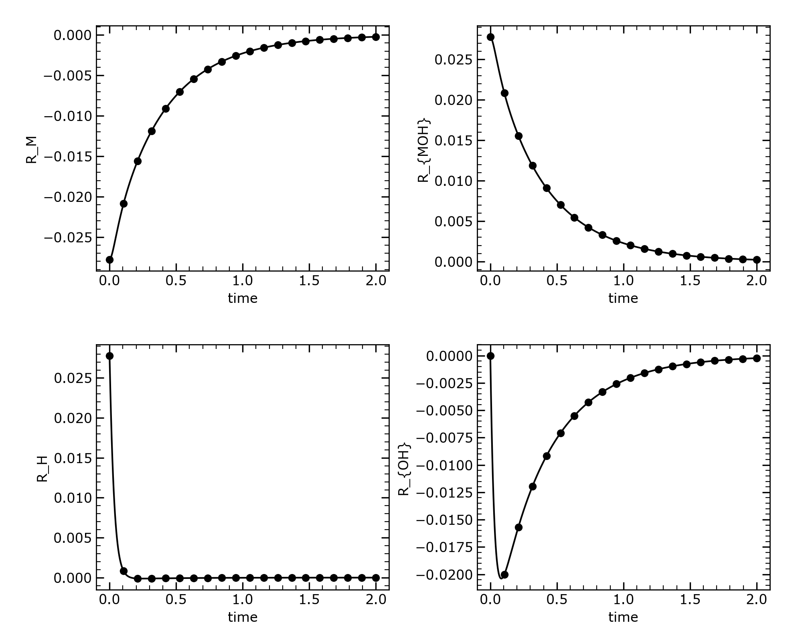
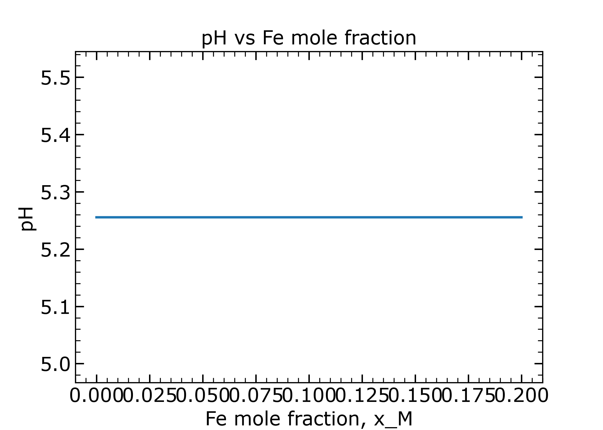

# Corrosion Simulations

## Overview

This module contains electrochemical corrosion simulations including anodic mobility, Tafel kinetics, and reaction rate analyses for metal dissolution in aqueous environments.

## Modules

### 1. Anodic Mobility

{ align=right width=45% }

**File:** `AnodicMobility/Mobility.py`

Models the mobility of metal ions at the electrode-electrolyte interface:

$$
L_\alpha = L_0 \exp\left(\frac{\alpha_a n_M F \eta}{RT}\right)
$$

where:

- $L_\alpha$ is the anodic mobility
- $L_0$ is the pre-exponential factor
- $\alpha_a$ is the anodic transfer coefficient
- $\eta = \phi_m - \phi_\ell$ is the overpotential
- $F$ is Faraday's constant
- $R$ is the gas constant
- $T$ is temperature

**Parameters:**

- $L_0 = 10^{-10}$ m⁴/(J·s)
- $\alpha_a = 0.5$
- $n_M = 2$ (valence)
- $T = 298$ K

**Output:** `Mobility.png`, `Overpotential.png`

### 2. Tafel Kinetics

{ align=right width=45% }

{ align=right width=45% style="clear: both;" }

**File:** `Tafel/Tafel.py`

Simulates Butler-Volmer electrochemical kinetics for corrosion reactions:

$$
i_a = i_0 \exp\left(\frac{\alpha_a n F (E - E_{eq})}{RT}\right)
$$

$$
i_c = -i_0 \exp\left(\frac{-\alpha_c n F (E - E_{eq})}{RT}\right)
$$

$$
i_{net} = i_a + i_c
$$

**Parameters:**

- Exchange current density: $i_0 = 1.0$ mA/cm²
- Transfer coefficients: $\alpha_a = \alpha_c = 0.5$
- Equilibrium potential: $E_{eq} = 0.0$ V

**Output:** 4 plots showing Tafel behavior and effect of transfer coefficient

### 3. Reaction Kinetics (Time Evolution)

{ align=right width=45% }

**File:** `ReationTime/ReactionTime.py`

Time-dependent simulation of metal corrosion reactions:

**Reactions:**
1. $\text{M} + \text{H}_2\text{O} \rightleftharpoons \text{MOH} + \text{H}^+$ with $K_1 = 10^{-4}$
2. $\text{H}_2\text{O} \rightleftharpoons \text{H}^+ + \text{OH}^-$ with $K_2 = 10^{-14}$

**Rate equations:**

$$
\frac{dx_M}{dt} = k_{b1}(-K_1 x_M + x_H x_{MOH})
$$

$$
\frac{dx_H}{dt} = k_{b1}(K_1 x_M - x_H x_{MOH}) + k_{b2}(K_2 - x_H x_{OH})
$$

**Parameters:**

- Backward rate constants: $k_{b1} = 2.78 \times 10^3$, $k_{b2} = 2.78 \times 10^3$
- Total concentration: $C_{tot} = 5.55 \times 10^4$ mol/m³
- Time step: $\Delta t = 10^{-5}$ s
- Total steps: $2 \times 10^5$

**Output:** `ReactionTime_Evolution_Rates.png`, `ReactionTime_Evolution_Concentrations.png`

### 4. Reaction Kinetics (Steady State)

{ align=right width=45% }

{ align=right width=45% style="clear: both;" }

**File:** `ReactionNew/ReactionNew.py`

Steady-state analysis of corrosion reactions as a function of metal concentration:

**Features:**

- pH calculation as a function of metal mole fraction
- Reaction rate profiles for Fe, FeOH, H⁺, and OH⁻
- Logarithmic pH plots

**Output:** 5 plots including `Metal_Oxide.png`, `Hydrogen_Oxide.png`, `PH_vs_xM.png`, `PH.png`, `log_PH.png`

### 5. Cui Model

**File:** `Cui.py`

Simple concentration normalization for solid and saturated states:

$$
C_{Se} = \frac{C_{solid}}{C_{solid}} = 1
$$

$$
C_{Le} = \frac{C_{sat}}{C_{solid}} = 0.0357
$$

**Parameters:**

- $C_{solid} = 143$ mol/m³ (atomic density)
- $C_{sat} = 5.1$ mol/m³ (solubility limit)

## Theory

The simulations are based on fundamental electrochemical principles:

**Butler-Volmer Equation:**

$$
i = i_0 \left[\exp\left(\frac{\alpha_a nF\eta}{RT}\right) - \exp\left(\frac{-\alpha_c nF\eta}{RT}\right)\right]
$$

**Nernst Equation:**

$$
E = E^0 + \frac{RT}{nF}\ln\frac{[Ox]}{[Red]}
$$

**Mass Action Law:**

$$
K_{eq} = \frac{[products]}{[reactants]}
$$

## Usage

```bash
# Run individual simulations
cd AnodicMobility && python3 Mobility.py
cd Tafel && python3 Tafel.py
cd ReationTime && python3 ReactionTime.py
cd ReactionNew && python3 ReactionNew.py
python3 Cui.py
```

## Applications

- Predicting corrosion rates in aqueous environments
- Electrode kinetics analysis
- pH evolution during metal dissolution
- Electrochemical cell design
- Passivation and protection studies
- Corrosion inhibitor screening

## References

- Cui, F., et al. (2022) - Mole fraction formulation for corrosion
- Butler-Volmer kinetics - Classical electrochemistry
- Tafel extrapolation methods
