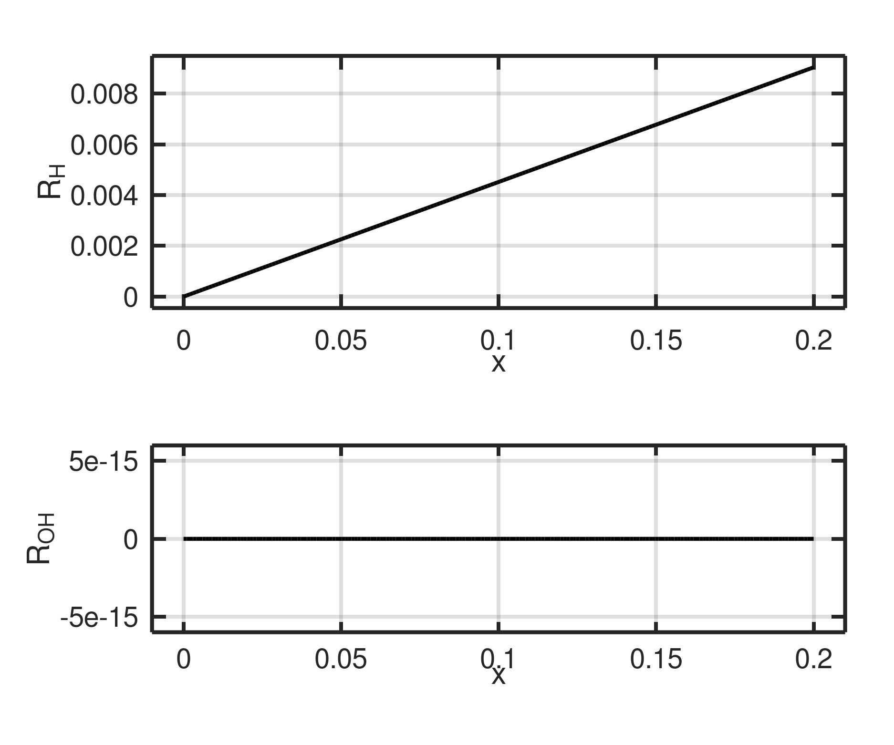

# Corrosion Reaction Rates

## Overview

This module calculates reaction rates for corrosion hydrolysis reactions and pH evolution as a function of iron mole fraction. The simulation models the dissolution of metal ions and the production of hydroxide species.

## Initial Constants

| Constant | Value | Description |
| -------- | ----- | ----------- |
| **K1** | `1.625e-4` | Equilibrium constant for Fe hydrolysis |
| **K2** | `1.0e-8` | Water self-ionization constant |
| **C_tot** | `5.55e4` | Total concentration (mol/m³) |
| **kb1** | `2.78e2` | Backward rate constant (1/s) |
| **kb2** | `2.78e3` | Backward rate constant for water (1/s) |

## Initial Mole Fractions

| Species | Value | Description |
| ------- | ----- | ----------- |
| **xM** | `0 to 0.2` | Fe²⁺ mole fraction (variable) |
| **xSolid** | `1.0` | Solid phase fraction |
| **xH** | `1e-7` | H⁺ mole fraction |
| **xOH** | `K2/xH` | OH⁻ mole fraction |
| **xMOH** | `1e-9` | FeOH⁺ mole fraction |

## Governing Reactions

### Fe hydrolysis reaction:
$$
\mathrm{Fe^{2+} + H_2O \leftrightarrow FeOH^+ + H^+}
$$

### Water self-ionization:
$$
\mathrm{H_2O \leftrightarrow H^+ + OH^-}
$$

## Rate Equations

$$
\begin{aligned}
R_M &= k_{b1}(-K_1 x_M x_{Solid} + x_H x_{MOH}) \\
R_{MOH} &= k_{b1}(K_1 x_M x_{Solid} - x_H x_{MOH}) \\
R_H &= k_{b1}(K_1 x_M x_{Solid} - x_H x_{MOH}) + k_{b2}(K_2 - x_H x_{OH}) \\
R_{OH} &= k_{b2}(K_2 - x_H x_{OH})
\end{aligned}
$$

## pH Calculation

The pH is calculated from the hydrogen ion concentration:

$$
\mathrm{pH} = -\log_{10}([\mathrm{H^+}])
$$

where:

$$
[\mathrm{H^+}] = \frac{x_H \cdot C_{tot}}{1000}
$$

## Results

### Metal and Hydroxide Reaction Rates

<div style="display: flex; flex-wrap: wrap; gap: 10px;" markdown="1">
  <figure markdown="span" style="border:1px solid #ccc; padding:4px; border-radius:6px; flex: 1 1 45%;">
    { width="600" }
    <figcaption>Fe & FeOH reaction rates vs Fe mole fraction</figcaption>
  </figure>

  <figure markdown="span" style="border:1px solid #ccc; padding:4px; border-radius:6px; flex: 1 1 45%;">
    { width="600" }
    <figcaption>H⁺ & OH⁻ production rates vs Fe mole fraction</figcaption>
  </figure>
</div>

### pH Evolution

<div style="display: flex; flex-wrap: wrap; gap: 10px;" markdown="1">
  <figure markdown="span" style="border:1px solid #ccc; padding:4px; border-radius:6px; flex: 1 1 45%;">
    { width="600" }
    <figcaption>pH vs H⁺ mole fraction (linear scale)</figcaption>
  </figure>

  <figure markdown="span" style="border:1px solid #ccc; padding:4px; border-radius:6px; flex: 1 1 45%;">
    { width="600" }
    <figcaption>pH vs H⁺ mole fraction (log scale)</figcaption>
  </figure>
</div>

## Code Implementation

```python
#!/usr/bin/env python3
from __future__ import annotations

import sys
from pathlib import Path
import numpy as np

ROOT_DIR = Path(__file__).resolve().parents[2]
if str(ROOT_DIR) not in sys.path:
    sys.path.insert(0, str(ROOT_DIR))

from src.plot_utils import save_dual_plot, save_single_plot

OUTPUT_DIR = Path(__file__).parent

def main() -> None:
    K1 = 1.625e-4
    K2 = 1.0e-8
    C_tot = 5.55e4

    kb1 = 2.78e7 * 1e-5
    kb2 = 2.78e8 * 1e-5

    xM = np.linspace(0, 0.2, 200)
    xSolid = np.ones_like(xM)
    xH = np.full_like(xM, 1e-7)
    xOH = K2 / xH
    xMOH = np.full_like(xM, 1e-9)

    R_M = kb1 * (-K1 * xM * xSolid + xH * xMOH)
    R_MOH = kb1 * (K1 * xM * xSolid - xH * xMOH)
    R_H = kb1 * (K1 * xM * xSolid - xH * xMOH) + kb2 * (K2 - xH * xOH)
    R_OH = kb2 * (K2 - xH * xOH)

    save_dual_plot(
        xM, R_M, R_MOH,
        x_label="Fe mole fraction, x_M",
        y_label="Mole-fraction reaction rate",
        y1_label="R_M", y2_label="R_{MOH}",
        filename=OUTPUT_DIR / "Metal_Oxide.png",
        title="Fe & FeOH reaction rates",
    )

    save_dual_plot(
        xM, R_H, R_OH,
        x_label="Fe mole fraction, x_M",
        y_label="Mole-fraction reaction rate",
        y1_label="R_H", y2_label="R_{OH}",
        filename=OUTPUT_DIR / "Hydrogen_Oxide.png",
        title="H / OH production rates",
    )

    conc_H = xH * C_tot / 1000
    PH = -np.log10(conc_H)

    save_single_plot(
        xM, PH,
        x_label="Fe mole fraction, x_M",
        y_label="pH",
        filename=OUTPUT_DIR / "PH_vs_xM.png",
        title="pH vs Fe mole fraction",
    )

if __name__ == "__main__":
    main()
```
