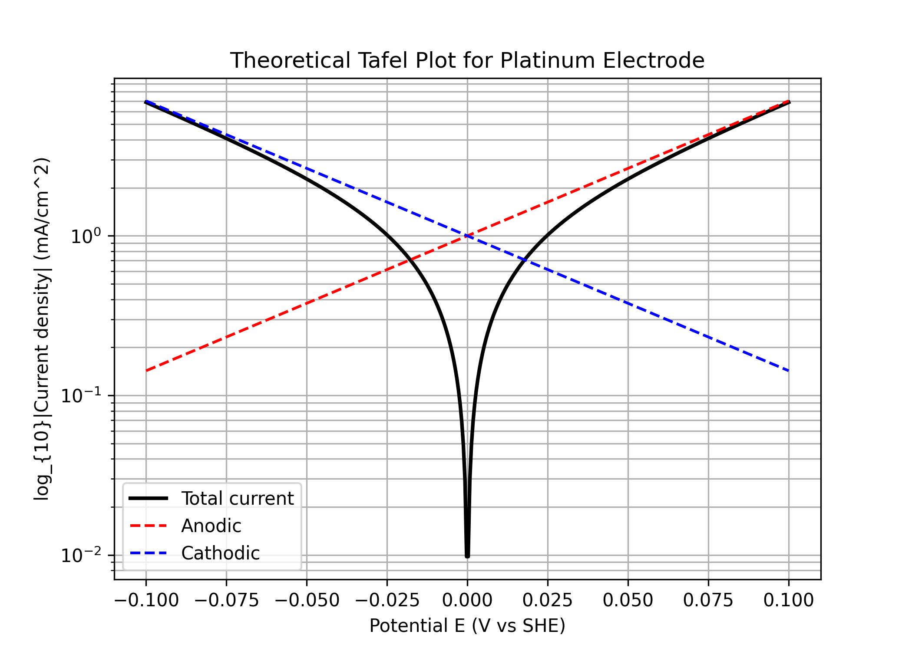
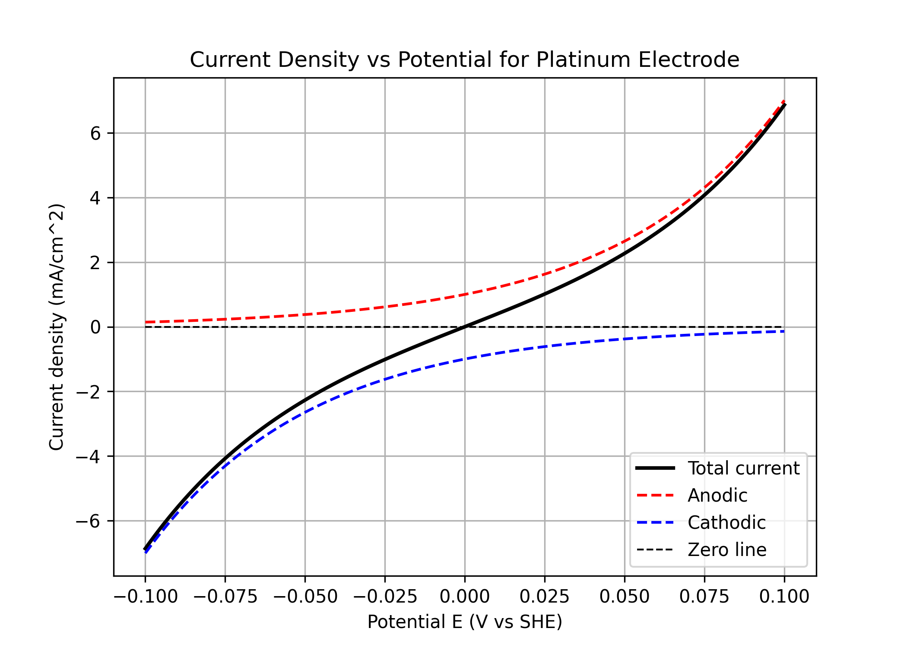

# Tafel Equation

## Butler–Volmer equation

---

$$
i_a = i_0 \, \exp\!\left(\frac{\alpha_a n F (E - E_{eq})}{R T}\right),
$$

$$
i_c = -\,i_0 \, \exp\!\left(-\frac{\alpha_c n F (E - E_{eq})}{R T}\right)
$$

$$
\begin{align*}
i_0 &= 1;      \\ % exchange current density (mA/cm^2) 
\alpha_a &= 0.5; \\  % anodic transfer coefficient 
\alpha_c &= 0.5; \\  % cathodic transfer coefficient 
E_{eq} &= 0.0;  \\  % equilibrium potential (V vs SHE for Fe)
\end{align*}
$$

## Constants
        

| Header 1 | Header 2 | Header 3              |
| -------- | -------- | --------------------- |
| F        | 96485    | C/mol                 |
| R        | 8.314    | J/mol·K               |
| T        | 298      | K                     |
| n        | 1        | electrons transferred |

## Plots

  <figure markdown="span" style="border:1px solid #ccc; padding:4px; border-radius:6px; flex: 1 1 45%;">
    { width="500" }
    <figcaption>Log |i| vs E Plot (Tafel Plot)</figcaption>
  </figure>

  <figure markdown="span" style="border:1px solid #ccc; padding:4px; border-radius:6px; flex: 1 1 45%;">
    { width="500" }
    <figcaption>Potential vs |i| Plot</figcaption>
  </figure>

  <figure markdown="span" style="border:1px solid #ccc; padding:4px; border-radius:6px; flex: 1 1 45%;">
    { width="500" }
    <figcaption>Potential vs Current Plot</figcaption>
  </figure>

  <figure markdown="span" style="border:1px solid #ccc; padding:4px; border-radius:6px; flex: 1 1 45%;">
    { width="500" }
    <figcaption>Potential vs Current Plot different alpha</figcaption>
  </figure>

---
