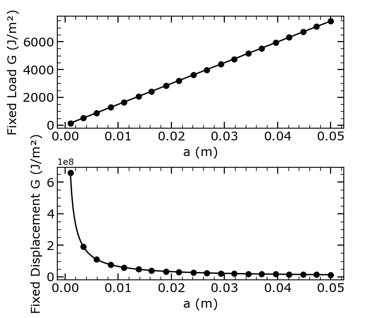

# Fracture Mechanics Simulations

## Overview

This module contains simulations related to fracture mechanics, including energy release rates and hydrogen-induced fracture degradation.

## Modules

### Energy Release Rate

{ align=right width=45% }

Located in `Energy/EnergyReleaseRate.py`

Demonstrates Griffith's theory of crack propagation under:

- **Fixed load** (stress-controlled): $G = \frac{\sigma^2 \pi a}{E}$
- **Fixed displacement** (strain-controlled): $G = \frac{\delta^2 E \pi}{a}$

**Parameters:**

- Young's modulus: $E = 210$ GPa
- Applied stress: $\sigma = 100$ MPa
- Critical energy: $G_c = 1000$ J/m²

**Output:** `EnergyReleaseRate.png`

### Hydrogen-Induced Degradation

{ align=right width=45% }

Located in `Hydrogen/Hydrogen.py`

Models the reduction of fracture energy due to hydrogen embrittlement using the Langmuir–McLean isotherm:

$$
\theta = \frac{C}{C + \exp(-\Delta G_{gb} / RT)}
$$

$$
\frac{G_c(C)}{G_c(0)} = 1 - \chi \theta
$$

**Parameters:**

- Temperature: $T = 300$ K
- Grain boundary energy: $\Delta G_{gb} = 30$ kJ/mol
- Degradation factor: $\chi = 0.41$

**Output:** `Hydrogen_FractureEnergy_vs_Concentration.png`

## Usage

```bash
cd Energy && python3 EnergyReleaseRate.py
cd Hydrogen && python3 Hydrogen.py
```

## Applications

- Predicting crack propagation in brittle materials
- Understanding hydrogen embrittlement
- Materials design for fracture resistance
