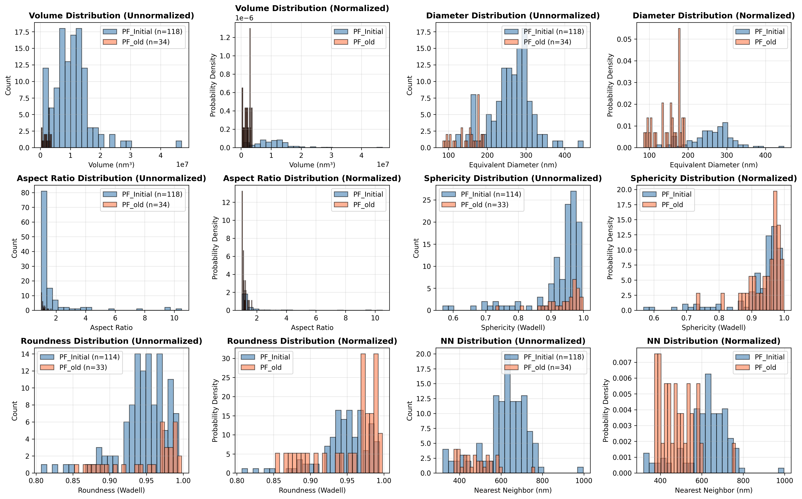
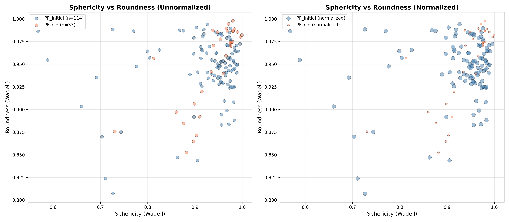

# Comparative Analysis: PF_Initial vs PF_old

## Overview

This document presents a comparative analysis of two phase-field simulations using the fast_rs library to calculate Wadell sphericity and roundness for γ' precipitates. Results are shown both in absolute terms (unnormalized) and normalized per unit area to enable fair comparison despite different grid sizes.

## Datasets Analyzed

| Property | PF_Initial | PF_old |
|----------|------------|--------|
| **Grid Size** | 256³ | 128³ |
| **Slice Position** | z=128 (middle) | z=64 (middle) |
| **Slice Dimensions** | 256 × 256 | 128 × 128 |
| **Physical Slice Area** | 58.98 µm² | 14.75 µm² |
| **Grid Spacing** | 30 nm | 30 nm |

## Key Findings

### Absolute Comparison (Unnormalized)

| Metric | PF_Initial | PF_old |
|--------|------------|--------|
| **Precipitates Detected** | 120 | 36 |
| **Precipitates Analyzed** | 118 | 34 |
| **γ' Area Fraction** | 70.3% | 15.4% |
| **Mean Volume** | 1.05×10⁷ nm³ | 1.99×10⁶ nm³ |
| **Mean Equivalent Diameter** | 261.4 nm | 149.4 nm |
| **Mean Aspect Ratio** | 1.74 | 1.14 |
| **Mean Sphericity (Wadell)** | 0.924 | 0.939 |
| **Mean Roundness (Wadell)** | 0.946 | 0.952 |
| **Mean NN Distance** | 620.0 nm | 480.7 nm |

### Normalized Comparison (per µm²)

| Metric | PF_Initial | PF_old | Ratio |
|--------|------------|--------|-------|
| **Precipitates per µm²** | 2.00 | 2.31 | 1.15× |
| **γ' Area Fraction** | 70.3% | 15.4% | 0.22× |
| **Mean Spacing** | 620.0 nm | 480.7 nm | 0.78× |

## Interpretation

### Microstructure Evolution

The comparison reveals significant differences in precipitate morphology:

1. **Volume Fraction**: PF_Initial shows **4.6× higher** γ' fraction (70.3% vs 15.4%), indicating advanced coarsening or different processing conditions

2. **Precipitate Size**:
   - PF_Initial precipitates are **5.3× larger** by volume
   - PF_Initial precipitates have **1.75× larger** equivalent diameter
   - This suggests significant growth/coarsening in PF_Initial

3. **Shape Characteristics**:
   - **Sphericity**: Both datasets show high sphericity (>0.92), but PF_old is slightly more spherical (0.939 vs 0.924)
   - **Roundness**: Both show high roundness (>0.94), indicating smooth edges/corners
   - **Aspect Ratio**: PF_Initial shows more elongated precipitates (1.74 vs 1.14)

4. **Spatial Distribution**:
   - Similar precipitate density (~2 per µm²)
   - PF_Initial has **1.29× larger** mean spacing (620 nm vs 481 nm)
   - Larger spacing correlates with larger precipitate size

### Coarsening Analysis

The data suggests PF_Initial represents a more advanced coarsening stage:

- **Ostwald Ripening**: Larger precipitates, higher volume fraction, increased spacing
- **Shape Evolution**: Larger precipitates develop more anisotropic (cuboidal) shapes (higher aspect ratio)
- **Number Density**: Similar precipitate counts per unit area, but individual precipitates are much larger

## Visualization

### Morphology Comparison

The 6-panel comparison shows:

**Left column (Unnormalized)**: Absolute histogram counts
- Shows PF_Initial has more precipitates (larger grid)
- Direct comparison of distributions

**Right column (Normalized)**: Probability density histograms
- Normalizes by total count to compare shapes of distributions
- Enables fair comparison despite different precipitate counts

**Key Observations**:
1. **Volume**: PF_Initial has broader distribution, shifted to larger values
2. **Diameter**: PF_Initial precipitates are consistently larger
3. **Aspect Ratio**: PF_Initial shows more shape anisotropy
4. **Sphericity**: Both datasets have similar distributions, slightly lower for PF_Initial
5. **Roundness**: Very similar distributions, both highly round
6. **Nearest Neighbor**: PF_Initial has larger mean spacing

### Sphericity vs Roundness

**Left (Unnormalized)**: Shows actual data point counts
- PF_Initial (blue): 118 precipitates
- PF_old (coral): 34 precipitates

**Right (Normalized)**: Point sizes scaled by fraction of total
- Enables visual comparison of distribution patterns
- Both datasets cluster in high sphericity/roundness region (0.8-1.0)

**Insights**:
- Both datasets show **strong positive correlation** between sphericity and roundness
- Most precipitates have both high sphericity AND high roundness
- PF_Initial shows slightly more scatter (larger variation in shapes)
- Few precipitates have low values (< 0.6) in either metric

## Statistical Significance

### Distribution Characteristics

Both datasets show:
- **High shape quality**: Mean sphericity and roundness > 0.92
- **2D slice effects**: 2D measurements tend to show higher sphericity than 3D
- **Consistent methodology**: Both analyzed with identical fast_rs parameters

### Morphological Differences

The key differentiators are:
- **Size**: 5× difference in mean volume
- **Volume fraction**: 4.6× difference
- **Aspect ratio**: 1.5× difference

These suggest different stages in the precipitation/coarsening process rather than measurement artifacts.

## Applications

This comparative analysis demonstrates:

1. **Heat Treatment Comparison**: Quantifying microstructural evolution between processing conditions
2. **Coarsening Kinetics**: Tracking precipitate growth and shape evolution
3. **Normalization Importance**: Area-normalized metrics enable fair comparison across different grid sizes
4. **Shape Metrics**: Sphericity and roundness provide complementary information about precipitate morphology

## Methodology Notes

### Normalization Strategy

**Unnormalized**: Shows absolute counts and values
- Useful for understanding total precipitate population
- Biased by grid size differences

**Normalized**: Accounts for different analysis areas
- Density metrics (per µm²) enable fair comparison
- Probability densities show distribution shapes
- Critical for comparing datasets of different sizes

### 2D Slice Limitations

- Single slice may not represent full 3D microstructure
- 2D sphericity tends to overestimate 3D sphericity
- Slice position affects results (middle slice chosen for consistency)

## Conclusions

1. **PF_Initial represents advanced coarsening**: Larger precipitates, higher volume fraction, increased spacing

2. **Shape evolution**: Larger precipitates develop more anisotropic (cuboidal) morphology while maintaining smooth interfaces (high roundness)

3. **Normalized comparison is essential**: Per-area metrics reveal similar precipitate densities (~2/µm²) despite different absolute counts

4. **fast_rs methodology is consistent**: Both datasets analyzed with identical parameters, enabling reliable comparison

## Files Generated

- `comparison_morphology.png` - 6-panel histogram comparison (normalized and unnormalized)
- `comparison_sphericity_roundness.png` - Scatter plots comparing shape metrics
- `comparison_summary.csv` - Detailed statistical comparison
- `comparison_normalized.csv` - Area-normalized metrics

## References

- [fast_rs GitHub Repository](https://github.com/PaPieta/fast_rs)
- Wadell, H. (1935). "Volume, Shape, and Roundness of Quartz Particles." *Journal of Geology*, 43(3), 250-280.
