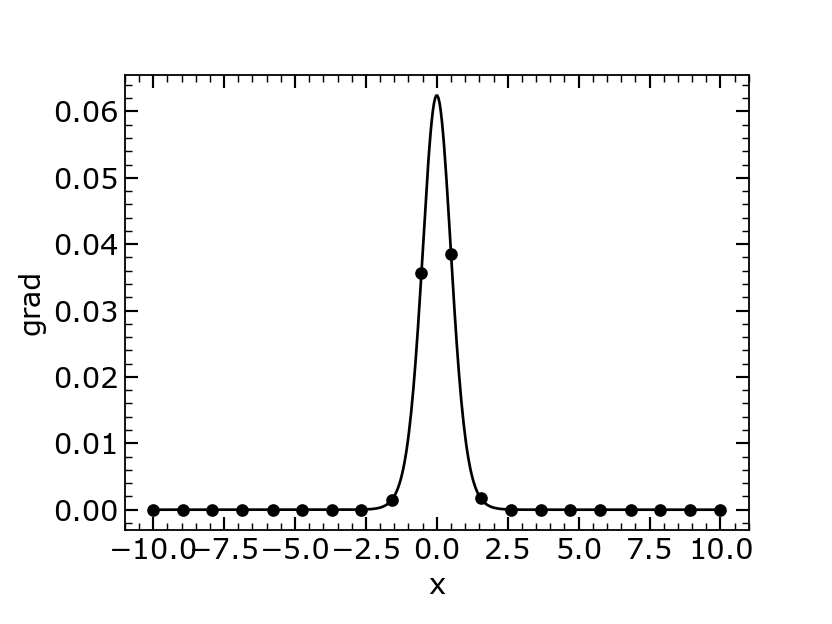

# Basic Simulation

## Overview

This module implements a basic phase field simulation of a diffuse interface.

- Uses a hyperbolic tangent profile for the order parameter \(\phi\).
- Calculates bulk and gradient energy densities.
- Computes interface thickness and total free energy.
- Includes a physical parameterization with different scaling for energy terms.
- Visualizes results with plots saved as PNG files.

## Equations Used

This section lists the key equations used in the simulation, including the diffuse interface order parameter, its gradient, bulk and gradient energy densities, interface thickness, and total free energy.

{ width=400px  align=right  }
### Diffuse interface order parameter:
- Diffuse interface order parameter \(\phi(x)\): describes the smooth transition of the phase field across the interface.
 
  $$\phi(x) = \frac{1}{2} \left(1 + \tanh(x)\right)$$


---

### Gradient of order parameter:

- Gradient of order parameter \(\frac{d\phi}{dx}\): measures the spatial rate of change of the phase field.
  $$\frac{d\phi}{dx} = \nabla \phi$$

### Bulk free energy density:

- Bulk free energy density \(f_{bulk}\): represents the local potential energy favoring phase separation.
  $$f_{bulk} = W \phi^2 (1 - \phi)^2$$

### Gradient energy density:

- Gradient energy density \(f_{grad}\): accounts for the energy cost of spatial variations in the phase field.
  $$f_{grad} = \frac{1}{2} \kappa \left(\frac{d\phi}{dx}\right)^2$$

### Interface thickness:

- Interface thickness \(\xi\): quantifies the width of the diffuse interface between phases.
  $$
 \xi = |x_{i_2} - x_{i_1}|
$$
     where:
    $$ 
        \phi(x_{i_1}) = 0.1, \phi(x_{i_2}) = 0.9
$$

### Total free energy:

- Total free energy \(F\): the integral of bulk and gradient energy densities, representing the system's total energy.
  $$F = \int (f_{bulk} + f_{grad}) \, dx$$

---

## Putting Physical Parameterization

### Physical bulk free energy density:

- Physical bulk free energy density \(f_{bulk, phys}\): bulk energy density with physical scaling.
  $$f_{bulk, phys} = \frac{18 \sigma}{\eta} \phi_{phys}^2 (1 - \phi_{phys})^2$$

### Physical gradient energy density:

- Physical gradient energy density \(f_{grad, phys}\): gradient energy density with physical scaling.
  $$f_{grad, phys} = \frac{1}{2} \sigma \eta \left(\frac{d\phi_{phys}}{dx}\right)^2$$

!!! important "Important" 
    
    if we solve the `equations with physical parameters`,
    then it will give us the total physical free energy of `1.0`.
    with **each** energy contributing half `0.5`.
     

!!! important "At Equilibrium"
<div class="grid cards" markdown>
-    $$F = \int f_{grad} \, dx = 0.5$$
-    $$F = \int f_{bulk} \, dx = 0.5$$

</div>


### Total physical free energy:

- Total physical free energy \(F_{phys}\): total energy with physical parameterization.

<div class="grid cards" markdown>
-    $$F = \int (f_{bulk} + f_{grad}) \, dx = 1.0$$
</div>

<div style="display:flex; gap:10px;" markdown="1">
  <figure markdown="span" style="border:1px solid #ccc; padding:4px; border-radius:6px;">
    { width="400" }
    <figcaption>Gradient Potential</figcaption>
  </figure>

  <figure markdown="span" style="border:1px solid #ccc; padding:4px; border-radius:6px;">
    { width="400" }
    <figcaption>Double well potential</figcaption>
  </figure>

</div>


```python
#!/home/alimuh7x/myenv/bin/python3
import sys
import os
sys.path.insert(0, os.path.abspath(os.path.join(os.path.dirname(__file__), '../../src')))

import numpy as np
import matplotlib.pyplot as plt
from Plotter import Plotter


def run_basic_simulation():
    # Parameters
    W = 1
    kappa = 0.5
    L = 20
    Nx = 500
    x = np.linspace(-L / 2, L / 2, Nx)

    # Diffuse interface
    phi = 0.5 * (1 + np.tanh(x))
    dphidx = np.gradient(phi, x)
    f_bulk = W * (phi ** 2) * ((1 - phi) ** 2)
    f_grad = 0.5 * kappa * (dphidx ** 2)

    phi_lower = 0.1
    phi_upper = 0.9
    i1 = np.argmin(np.abs(phi - phi_lower))
    i2 = np.argmin(np.abs(phi - phi_upper))
    xi = np.abs(x[i2] - x[i1])
    print(f'Interface thickness Cksi = {xi:.4f}')

    F_total = np.trapezoid(f_bulk + f_grad, x)
    print(f'Total energy F = {F_total:.6f}')

    plotter = Plotter()
    plotter.plot1D(x, phi, xlabel='x', ylabel='phi', filename='Emperical_phi.png')
    plotter.plot1D(x, f_bulk, xlabel='x', ylabel='potential', filename='Emperical_potential.png')
    plotter.plot1D(x, f_grad, xlabel='x', ylabel='grad', filename='Emperical_grad.png')
    print('Plots created and saved as Emperical.png')

    eta = 4
    sigma = 1
    phi_phys = 0.5 * (1 + np.tanh(3 * x / eta))
    dphidx_phys = np.gradient(phi_phys, x)
    f_bulk_phys = 18 * sigma / eta * (phi_phys ** 2) * ((1 - phi_phys) ** 2)
    f_grad_phys = 0.5 * sigma * eta * (dphidx_phys ** 2)

    F_total_phys = np.trapezoid(f_bulk_phys + f_grad_phys, x)
    F_bulk = np.trapezoid(f_bulk_phys, x)
    F_grad = np.trapezoid(f_grad_phys, x)
    print(f'Total energy F = {F_total_phys:.6f}')
    print(f'Potential energy F = {F_bulk:.6f}')
    print(f'Gradient energy F = {F_grad:.6f}')

    return {
        'x': x,
        'phi': phi,
        'f_bulk': f_bulk,
        'f_grad': f_grad,
        'xi': xi,
        'F_total': F_total,
        'phi_phys': phi_phys,
        'f_bulk_phys': f_bulk_phys,
        'f_grad_phys': f_grad_phys,
        'F_total_phys': F_total_phys,
        'F_bulk': F_bulk,
        'F_grad': F_grad,
    }


if __name__ == '__main__':
    run_basic_simulation()
```
