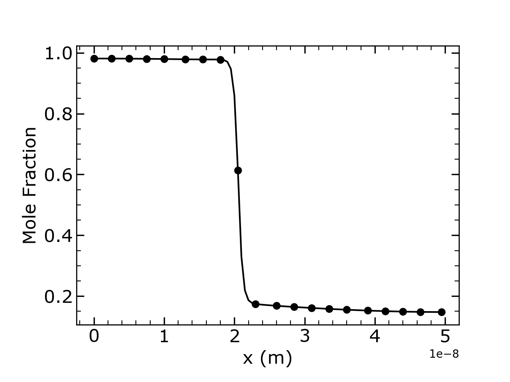

# 1D Diffusion + Phase-Field Interface Simulation

**This simulation models:**

- 1D diffusion across an interface,
- chemical potential–driven evolution,
- phase-field interface motion,
- free energy reduction,
- and the evolution of driving force during transformation.

---

!!! info   
    
    - Spatial resolution: `dx = 0.5 nm`
    - Domain size: `Nx = 100`
    - Interface width: `w = 8 dx`
    - Time steps: `nsteps = 10,000`
    - Phase-field mobility: `Lϕ = 1 × 10⁻¹⁵`
    - Diffusivities:  
      - α-phase: `Dα = 5 × 10⁻¹⁶`  
      - β-phase: `Dβ = 5 × 10⁻¹⁶`

---


## 🔘 1. Initial Condition

The initial interface profile is:

$$
\phi(x) = \frac{1}{2} \left[ 1 - \tanh\left(\frac{3(x - x_0)}{w}\right) \right]
$$

Where:

- `ϕ = 1` → α-phase  
- `ϕ = 0` → β-phase

Initial concentration:
\[
c = \phi_\alpha C_\alpha + \phi_\beta C_\beta
\]
with  
- \( C_\alpha = 1.0 \)  
- \( C_\beta = 0.0 \)

---

## 🔘 2. Chemical Potential

The chemical potential is:

$$
\mu = A V_m \left[(c - C_{\alpha}^{eq}) \phi_\alpha + (c - C_{\beta}^{eq}) \phi_\beta\right]
$$

This drives diffusion through:

$$
\frac{\partial c}{\partial t} = M \nabla^2 \mu
$$

Where:

$$
M = \frac{D_\alpha \phi_\alpha + D_\beta \phi_\beta}{RT}
$$

---

## 🔘 3. Phase-Field Evolution

The phase-field variable evolves by:

$$
\frac{\partial \phi}{\partial t}
= L_\phi \left[ \sigma(\nabla^2\phi - \frac{\partial W}{\partial \phi})
+ \frac{6}{w}\,\phi_\alpha\phi_\beta \Delta f \right]
$$

Where:

- `W` = double-well potential  
- `Δf` = chemical free energy difference  

This controls interface motion.

---

## 🔘 4. Results

### ▶ **Final Concentration Profile**


This plot shows how `c(x)` evolves under the chemical potential gradient.

{ align=left }

### ▶  Free Energy Calculation

The local free energy density of each phase is defined as:

<div class="eq-box" markdown="1">

$$
f_{\alpha}(c) = \frac{1}{2} A \,(c - C_{\alpha}^{eq})^2
$$

$$
f_{\beta}(c) = \frac{1}{2} A \,(c - C_{\beta}^{eq})^2
$$

</div>

The mixture free energy is obtained using phase fractions:

$$
f_{\text{local}} = \phi_{\alpha} f_{\alpha} + \phi_{\beta} f_{\beta}
$$

Finally, the total free energy of the system is computed by numerical integration:

$$
F = \int f_{\text{local}}(x) \, dx
$$

In the code, this is implemented as:

``` py linenums="1" title="bubble_sort.py"
# Free energy
f_alpha = 0.5 * A * (c - Ceq_alpha)**2
f_beta = 0.5 * A * (c - Ceq_beta)**2
f_local = phi_alpha * f_alpha + phi_beta * f_beta

Energy = np.trapezoid(f_local, x)
EnergyN.append(abs(Energy))
```

---

### ▶ **Driving Force Evolution**

The transformation driving force:

<div class="eq-box" markdown="1">


$$
\Delta f = (f_\beta - f_\alpha) \phi_\alpha \phi_\beta
$$

</div>
Averaged across the interface region.


---

## 🔘 5. Conservation Check

During simulation, the total concentration:

$$
\int c(x)\, dx
$$

is checked every 500 steps.

Small deviations (< 1%) indicate  
**numerical stability and good timestep selection**.

---

## 🔘 6. Key Observations

- The interface moves toward the energetically favorable phase.  
- The driving force peaks early and decreases as equilibrium approaches.  
- Free energy consistently drops → system relaxes to stable configuration.  
- Concentration flux smooths with time.

---

### Simulation Results


<div style="display:flex; gap:10px;" markdown="1">
  <figure markdown="span" style="border:1px solid #ccc; padding:4px; border-radius:6px;">
    { width="300" }
    <figcaption>Final Concentration</figcaption>
  </figure>

  <figure markdown="span" style="border:1px solid #ccc; padding:4px; border-radius:6px;">
    { width="300" }
    <figcaption>Driving Force</figcaption>
  </figure>

  <figure markdown="span" style="border:1px solid #ccc; padding:4px; border-radius:6px;">
    { width="300" }
    <figcaption>Energy</figcaption>
  </figure>
</div>

