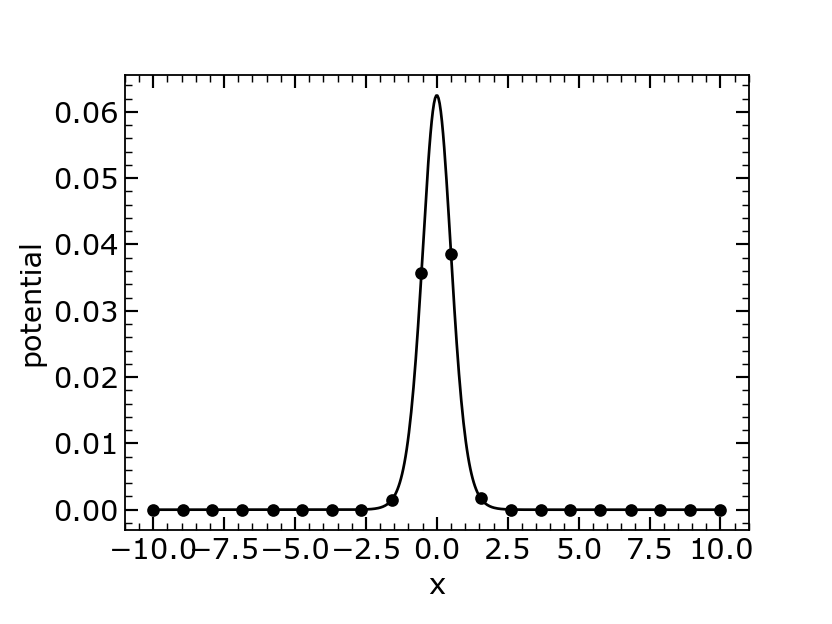
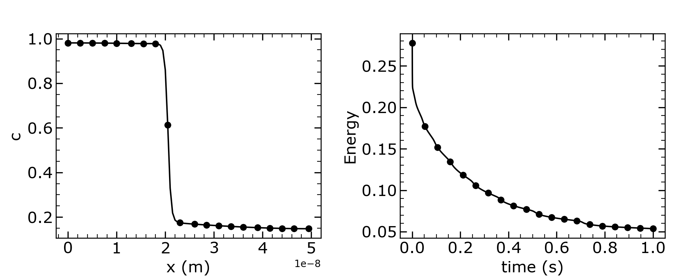

# OpenPhase: Phase-Field Simulations

## Overview

This module contains phase-field simulations for microstructure evolution, including basic interface energy calculations and parabolic diffusion-controlled phase transformations.

## Modules

### 1. Basic Phase-Field

{ align=right width=45% }


{ align=right width=45% style="clear: both;" }

**File:** `Basic/Basic.py`

Demonstrates fundamental phase-field concepts including interface energy and width calculations.

**Theory:**

The phase-field variable $\phi$ varies smoothly across interfaces:

$$
\phi(x) = \frac{1}{2}\left(1 + \tanh\left(\frac{x}{\xi}\right)\right)
$$

where $\xi$ is the interface width.

**Free Energy Functional:**

$$ F = \int \left[f_{bulk}(\phi) + f_{grad}(\nabla\phi)\right] dx $$

**Bulk Free Energy (Double-Well Potential):**

$$ f_{bulk} = W \phi^2 (1 - \phi)^2 $$

**Gradient Energy:**

$$ f_{grad} = \frac{1}{2}\kappa |\nabla\phi|^2 $$

**Physical Interpretation:**

For physically meaningful interface energy $\sigma$ and width $\eta$:

$$ f_{bulk} = \frac{18\sigma}{\eta} \phi^2 (1 - \phi)^2 $$

$$ f_{grad} = \frac{1}{2}\sigma\eta |\nabla\phi|^2 $$

**Parameters:**

- $W = 1$ - Energy barrier
- $\kappa = 0.5$ - Gradient coefficient
- Domain: $L = 20$
- Grid points: $N_x = 500$

**Output:** 3 plots

- `Emperical_phi.png` - Phase-field profile
- `Emperical_potential.png` - Bulk energy density
- `Emperical_grad.png` - Gradient energy density

### 2. Parabolic Diffusion with Phase Transformation

{ align=right width=45% }


{ align=right width=45% style="clear: both;" }

**File:** `ParabolicDiffusion/ParabolicDiffusion.py`

Simulates coupled diffusion and phase transformation with parabolic free energy.

**Governing Equations:**

**Diffusion Equation (with chemical potential):**

$$ \frac{\partial c}{\partial t} = \nabla \cdot \left[M \nabla \mu\right] $$

**Chemical Potential:**

$$ \mu = \frac{\partial f}{\partial c} = A V_m (c - C_{eq}^\alpha)\phi_\alpha + A V_m (c - C_{eq}^\beta)\phi_\beta $$

**Phase-Field Evolution (Allen-Cahn):**

$$ \frac{\partial \phi}{\partial t} = L_\phi \left[\sigma(\nabla^2\phi - \frac{\partial W}{\partial \phi}) + \frac{6}{w}\phi_\alpha\phi_\beta\Delta f\right] $$

**Double-Well Potential Derivative:**

$$ \frac{\partial W}{\partial \phi} = \frac{72 \cdot 2}{w^2} \phi(1-\phi)(1-2\phi) $$

**Free Energy Densities:**

- Phase $\alpha$: $f_\alpha = \frac{1}{2}A(c - C_{eq}^\alpha)^2$
- Phase $\beta$: $f_\beta = \frac{1}{2}A(c - C_{eq}^\beta)^2$

**Driving Force:**

$$ \Delta f = (f_\beta - f_\alpha)\phi_\alpha\phi_\beta $$

**Parameters:**

- Grid spacing: $dx = 0.5$ nm
- Grid points: $N_x = 100$
- Time step: $dt = 10^{-4}$ s
- Total steps: 10,000
- Interface width: $w = 8\,dx = 4$ nm
- Free energy parameter: $A = 4 \times 10^8$ J/m³
- Phase-field mobility: $L_\phi = 10^{-15}$ m³/(J·s)
- Surface tension: $\sigma = 0.5$ J/m²
- Diffusion coefficients: $D_\alpha = D_\beta = 5 \times 10^{-16}$ m²/s
- Equilibrium concentrations:
  - $C_{eq}^\alpha = 1.0$
  - $C_{eq}^\beta = 0.2$

**Stability Criteria:**

The simulation checks the CFL (Courant-Friedrichs-Lewy) condition:

$$ \frac{\dot{c} \cdot \Delta t}{c} < 0.1 $$

$$ D \cdot \Delta t < \frac{\Delta x^2}{6} $$

**Output:** 2 plots

- `DrivingForce.png` - Driving force evolution
- `Composition_Energy.png` - Final composition profile and energy evolution

## Physical Interpretation

### Phase-Field Method

The phase-field method replaces sharp interfaces with diffuse interfaces described by a continuous order parameter $\phi$:

- $\phi = 0$: Phase $\beta$ (e.g., liquid)
- $\phi = 1$: Phase $\alpha$ (e.g., solid)
- $0 < \phi < 1$: Interface region

### Interface Properties

**Interface Energy:**

$$ \sigma = \int_{-\infty}^{\infty} \left[f_{bulk}(\phi) + f_{grad}\right] dx $$

**Interface Width:**

$$ \xi \approx \frac{\text{distance where } \phi \text{ varies from 0.1 to 0.9}}{\text{characteristic length}} $$

### Thermodynamic Consistency

The model satisfies:

1. **Energy minimization:** System evolves to minimize free energy
2. **Mass conservation:** Total concentration is conserved
3. **Second law:** Entropy production is always non-negative

## Usage

```bash
# Run Basic simulation
cd Basic && python3 Basic.py

# Run Parabolic Diffusion simulation
cd ParabolicDiffusion && python3 ParabolicDiffusion.py
```

## Output Interpretation

### Basic Simulation

- Shows interface width $\xi \approx 2.2$
- Total interface energy $F \approx 1.0$ (physical units)
- Demonstrates balance between bulk and gradient energies

### Parabolic Diffusion Simulation

- Tracks phase transformation kinetics
- Monitors driving force evolution
- Validates mass conservation (error < 0.15%)
- Shows energy decrease over time (thermodynamic consistency)

## Applications

- Solidification: Dendritic growth, eutectic structures
- Precipitation: Second-phase nucleation and growth
- Grain growth: Polycrystalline evolution
- Spinodal decomposition: Phase separation
- Recrystallization: Microstructure refinement
- Additive manufacturing: Rapid solidification modeling

## References

- Allen, S. M., & Cahn, J. W. (1979). A microscopic theory for antiphase boundary motion
- Steinbach, I. (2009). Phase-field models in materials science
- Chen, L.-Q. (2002). Phase-field models for microstructure evolution
- Provatas, N., & Elder, K. (2010). Phase-field methods in materials science

## Numerical Methods

- Finite difference for spatial derivatives
- Forward Euler for time integration
- Periodic boundary conditions for concentration
- CFL condition checking for stability
- Mass conservation monitoring