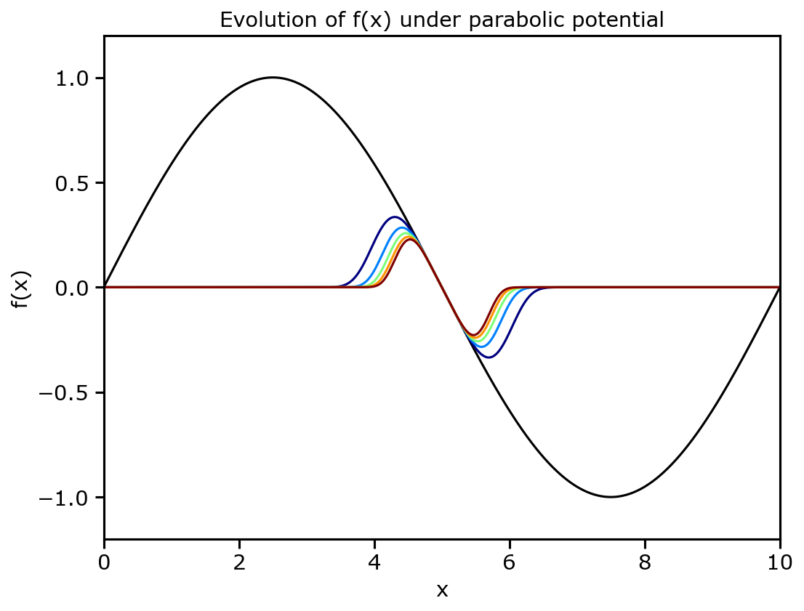
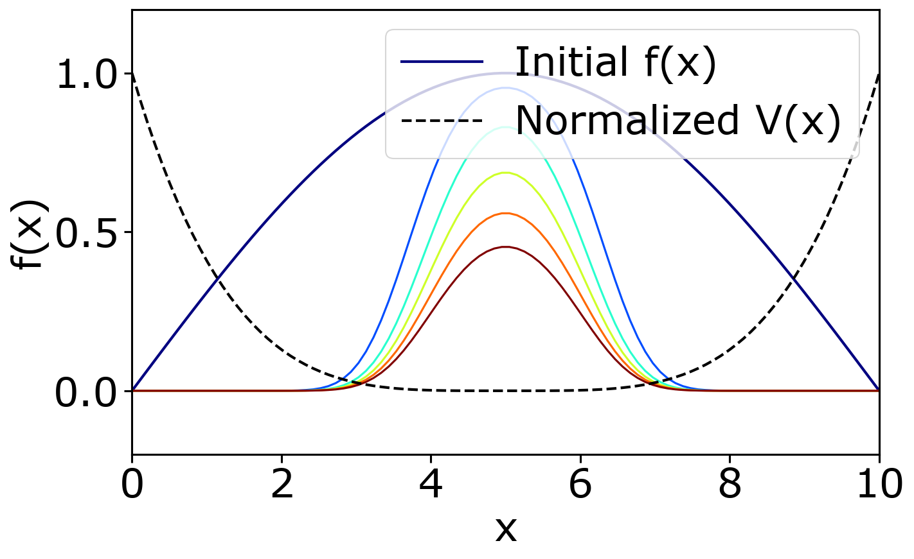

# Potential Field Simulations

## Overview

This module simulates field evolution under various potential energy landscapes, including diffusion-advection, potential field evolution, and spring chain dynamics.

## Modules

### 1. Advection (Potential-Driven Diffusion)

{ align=right width=45% }

**File:** `Advection/advection.py`

Simulates coupled diffusion and advection under a parabolic potential:

$$
\frac{\partial f}{\partial t} = D \nabla^2 f + \nabla \cdot (f \nabla V)
$$

- **Potential:** $V(x) = 0.5(x - 5)^2$
- **Diffusion coefficient:** $D = 0.1$
- **Output:** `diffusion_advection.png`

### 2. Potential Field Evolution

{ align=right width=45% }

**File:** `Potential/Potential.py`

Models field decay under a quartic potential:

$$
\frac{\partial f}{\partial t} = -V(x) \cdot f
$$

- **Potential:** $V(x) = 0.5(x - 5)^4$
- **Output:** `V_f.png`, `f_evolution_snapshots.png`

### 3. Spring Chain Dynamics

{ align=right width=45% }

**File:** `Spring/spring_file.py`

Simulates a 1D spring chain with external potential using:

$$
\frac{\partial f}{\partial t} = M \left( k \nabla^2 f - 2V(x)f \right)
$$

- **Spring constant:** $k = 1$
- **Mobility:** $M = 1$
- **Potential:** $V(x) = 0.5(x - 5)^4$
- **Output:** `spring_chain_snapshots.png`

## Usage

```bash
cd Advection && python3 advection.py
cd Potential && python3 Potential.py
cd Spring && python3 spring_file.py
```

## Applications

- Phase field modeling
- Pattern formation
- Reaction-diffusion systems
- Energy landscape exploration
