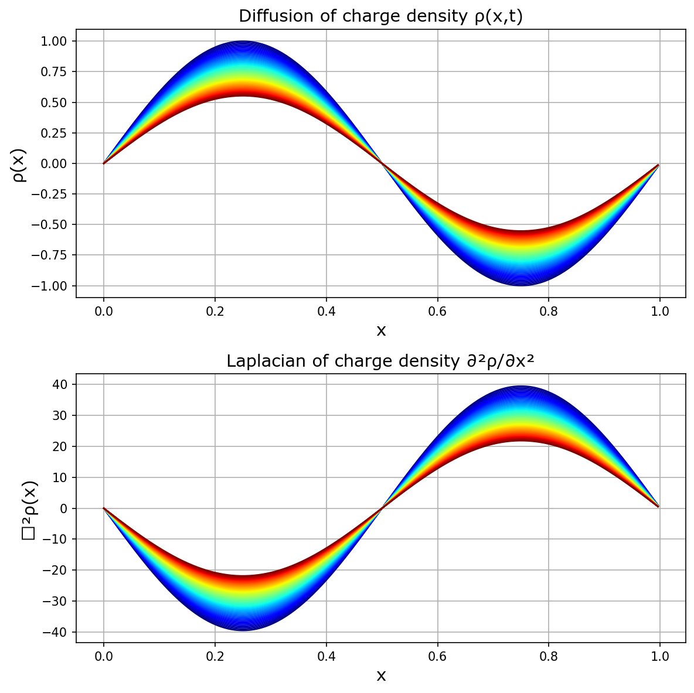
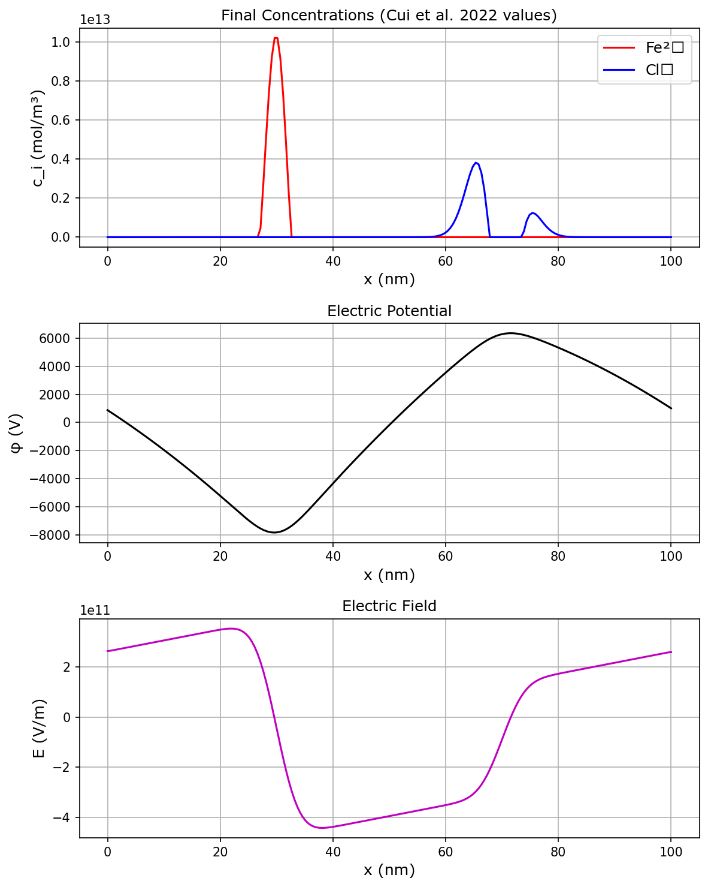
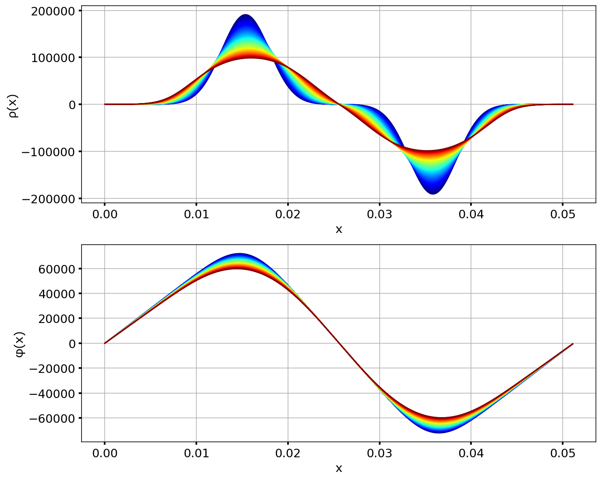

# Potential and Flux Simulations

## Overview

This module contains advanced simulations of electrochemical charge transport, Poisson equation solvers, and coupled diffusion-migration systems.

## Modules

### 1. Charge Transport

{ align=right width=45% }

**File:** `ChargeTransport/ChargeTransport.py`

Solves the 1D Poisson equation using the Successive Over-Relaxation (SOR) method:

$$
\frac{d^2\phi}{dx^2} = -\frac{\rho(x)}{\epsilon_0}
$$

- **Method:** SOR with $\omega = 1.9$
- **Output:** `Numerical_SOR.png`


### 2. Diffusion

{ align=right width=45% }

**File:** `Diffusion/Diffusion.py`

Pure diffusion simulation using FFT-based spectral methods:

$$
\frac{\partial \rho}{\partial t} = D \nabla^2 \rho
$$

- **Diffusion coefficient:** $D = 10^{-4}$ m²/s
- **Output:** `Diffusion_and_Laplacian.png`


### 3. Mole Fraction Poisson Solve

{ align=right width=45% }

**File:** `MoleFractionPoissonSolve/MoleFractionPoissonSolve.py`

Simulates ionic transport in corrosion using Cui et al. (2022) parameters:

- Fe²⁺ and Cl⁻ ions
- Coupled Poisson-Nernst-Planck system
- **Output:** `ElectricField_Vectors.png`, `Density.png`


### 4. Poisson Equation (1D)

{ align=right width=45% }
{ align=right width=45% }

**File:** `PoissonEquation/PoissonEquation.py`

Comprehensive 1D Poisson solver with:

- FFT-based solution
- Electric field calculation
- Charge flux analysis
- **Output:** Multiple analysis plots


### 5. Poisson Equation (2D)

{ align=right width=45% }
{ align=right width=45% }

**File:** `PoissonEquation2D/PoissonEquation2D.py`

2D Poisson equation solver with vector field visualization:

$$
\nabla^2 \phi = -\frac{\rho}{\epsilon_0}
$$

- Separates positive/negative charges
- Computes electric field vectors
- **Output:** 6 field plots with vector arrows


### 6. Poisson Equation with Time Evolution

{ align=right width=45% }

**File:** `PoissonEquationTime/PoissonEquationTime.py`

Time-dependent Poisson-Nernst-Planck system:

$$
\frac{\partial c_i}{\partial t} = -\nabla \cdot \mathbf{J}_i
$$

$$
\mathbf{J}_i = -D \nabla c_i + z_i \mu c_i \mathbf{E}
$$

- Drift-diffusion coupling
- Fe²⁺ and Cl⁻ migration
- **Output:** `Charge_Evolution.png`, `Density_M_High.txt`


## Theory

These simulations solve the fundamental equations of electrochemistry:

**Poisson Equation:**

$$
\nabla^2 \phi = -\frac{\rho}{\epsilon_0}
$$

**Nernst-Planck Equation:**

$$
\mathbf{J}_i = -D_i \nabla c_i + z_i \frac{F}{RT} D_i c_i \nabla \phi
$$

**Continuity Equation:**

$$
\frac{\partial c_i}{\partial t} + \nabla \cdot \mathbf{J}_i = 0
$$

## Usage

```bash
cd ChargeTransport && python3 ChargeTransport.py
cd Diffusion && python3 Diffusion.py
cd MoleFractionPoissonSolve && python3 MoleFractionPoissonSolve.py
cd PoissonEquation && python3 PoissonEquation.py
cd PoissonEquation2D && python3 PoissonEquation2D.py
cd PoissonEquationTime && python3 PoissonEquationTime.py
```

## Applications

- Corrosion modeling
- Battery simulation
- Electrochemical deposition
- Semiconductor device physics
- Biological ion channels
